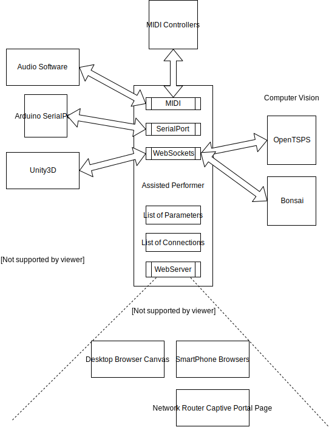

# Assisted Performer 

Assisted Performer is a node.js server project that serves small webpages and acts as a proxy for parameter controllers. Bridging MIDI, OSC, websockets, HTTP requests, etc between applications.

Check the branches of this repository for different example projects that have been done using the same core functionality that is explained below.

# Schema

# Installing in Windows

Assisted Performer has only been tested on Windows 8 and Windows 10. No clue if it works out of the box on Mac or Linux.

Install [nodejs](http://nodejs.org/)

Clone the repo and call `npm install` to install all dependencies.

## MIDI support

If you want to handle MIDI parameter install [loopmidi](https://www.tobias-erichsen.de/software/loopmidi.html) aswell.

MIDI module dependencies requires [visual studio](https://www.visualstudio.com/downloads/) installed to succeed `npm install`.

Please be aware that VS2015CE installer does not install windows 8.1 SDK and visual c++ by default, which is needed. You need to launch VS, go to File -> New -> Projects, select C++ section and click the install option.

## serialport support

If you want to handle serialport communication call `npm install -g serialport` to install serialport globally (also installs some useful command-line tools)

`serialport-list` will list you all the devices you have (you'll need it to know the name of the active port you want to interface with)

# Installing in Mac / Linux

Assisted Performer has only been tested on Windows 8 and Windows 10. It should work on Linux or MAC, the only dependency that seems to be windows only in the MIDI library. You can comment the package out of `packages.json` and all the references to MIDI from `app.js` 

If you are testing it, please document any issues.

Install [nodejs](http://nodejs.org/)

Clone the repo and call `npm install` to install all dependencies.

# Running 

Just call `npm start`

If you use `launch_server.bat` make sure you edit the path.

# Architecture

Assisted Performer is a server, it configures default parameters, launches some services (like webserver) and sits listening for connections.

The audio parameters are hardcoded inside `app.js` and cannot be altered during runtime (TODO: be reconfigurable in realtime for multipart performances).

The graphical parameters are defined by connection with the canvas element. Canvas can be anything that sends the JSON configuration string. Included are examples for a web based canvas (`http://localhost/canvas/`) and a Unity client canvas.

There should only be one canvas connected at a time. The system responds to the latest connected one only. (TODO: allow multiple canvas, gracefully handle conflicting parameter names, secure against canvas hijacking by trolls in the network)

The canvas object configures a set of parameters for usage: their names, default value, minimum value and maximum value.

Pre-configured webpages are used to control these parameters. The server listens for multiple connections (typically from a browser or captive portal page on a smartphone) and assigns each device a single parameter to control.

The system can be configured to manage a voting system, multiple users selecting same parameters. (TODO: module example of voting system)

The system can also listen in to TSPS OSC connections and bind parameters to blob tracking values. (TODO: module easy to configure the binding)

There is a [http://localhost/master](master) webpage available to see all parameters currently available.

The system sends back the audio parameters via MIDI interface.

The system sends back the graphic parameters via websocket or POST REQUEST RESPONSE to the canvas element.

Pressing the 'f' key on the command line console toggles the float back mode for all parameter values. Where the server recurringly interpolates between their current value and it's original default value, effectively floating the value back into the default value unless users keep trying to force it to another value.

The system can be configured to send logs to [winston](http://thisdavej.com/using-winston-a-versatile-logging-library-for-node-js/) or save them locally.

# What Assisted Performer can do

* serve page to control unique parameters 1:1

* serve page to control parameters many:1 (average, button mashing, groups)

* serve page to control multiple parameters (master controller)

* voting systems for masses with realtime feedback

* proxy controllers to/from audio software (OSC, MIDI)

* proxy controllers to/from canvas engines (web browsers, Unity3D)

* integration with computer vision protocols (OpenTSPS)

* integration with twitch chat (chatbot server)

* logging

# Project Examples

* [PLUNC Festival 2017 - Underwater Assisted Performer](http://artica.cc/blog/2016/11/21/plunc.html) ([plunc branch](https://github.com/psenough/assisted_performer/tree/plunc))

* [Demobit 2017 - There is, in cyberspace](https://www.youtube.com/watch?v=KSuc_ZdtgLA) ([demobit branch](https://github.com/psenough/assisted_performer/tree/demobit), [alt_poem branch](https://github.com/psenough/assisted_performer/tree/alt_poem))

* [Evoke 2017 - Who wants to be a demoscener?](http://www.pouet.net/prod.php?which=71569) ([who_wants_to_be_a_demoscener branch](https://github.com/psenough/assisted_performer/tree/who_wants_to_be_a_demoscener))

* [Aura Festival 2018 - Procedural Forest](https://www.facebook.com/artica.cc/videos/316982048867870/) ([festival_aura branch](https://github.com/psenough/assisted_performer/tree/festival_aura))

* [Evoke 2018 - Interactive fun with accents!](http://www.pouet.net/prod.php?which=77814) ([interactive_standup branch](https://github.com/psenough/assisted_performer/tree/interactive_stand_up))

* [Residência Expand 2018 - Collaborative Haiku Dream](https://www.youtube.com/watch?v=zji3Ft6pEhg) ([residencia_expand branch](https://github.com/psenough/assisted_performer/tree/residencia_expand))

* [Névoke 2021 - Community crossword twitch stream](https://www.youtube.com/watch?v=KQx4DMMS4pI) ([twitch_crosswords](https://github.com/psenough/assisted_performer/tree/twitch_crosswords))

# Tutorial Videos

Some day, who knows? :)
